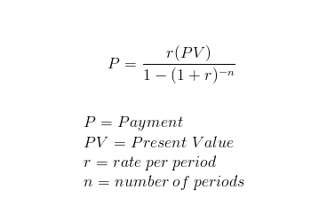

# Projects TODO

## 1. Simple interest loan calculator  | Console app  
I (interest) = P (principal) x r (rate) x t (time periods).
Example:  
On a two-year loan of $20,000 with an annual interest rate of 8 percent, the simple interest is calculated as follows:  

20,000 x .08 x 2 = $3,200

Therefore, the total amount owed will be $23,200: $20,000 for the principal and $3,200 for interest.  

## 2. Loan payment calculator  | Console app  


## 3. Netflix searcher | Console app  
Read a netflix_titles.csv, parse it into a class or dictionary, keep it in memory.  
1. Search by title  
2. Search by year  
3. Search by director    
4. Search by cast        
5. Search by duration        
6. Search by description  

Create a console application with parse args, see planets example

## 4. Netflix searcher | API  
1. Using the same logic created before, create an API service  
2. Create an endpoint for inserting new movies

## 5. Decorator
1. Create a decorator for caching SQL result sets, so we avoid creating connections to DB  
Expected output
   
```shell
 OUTPUT
 first time query
 Person not in cached, SQL Connection required
 Person saved into cached, for next queries
 Person(id=2, name='Andres', age=25)
 second time query
 Getting person from cached, avoided SQL Connection
 Person(id=2, name='Andres', age=25)
```

## 6. API IN GCP
1. Create a basic Flask Application  
   1.1 GET  
   1.2 POST  
   1.3 PATCH  
   1.4 DELETE  
2. Make a deploy in GCP with APP Engine Service  
